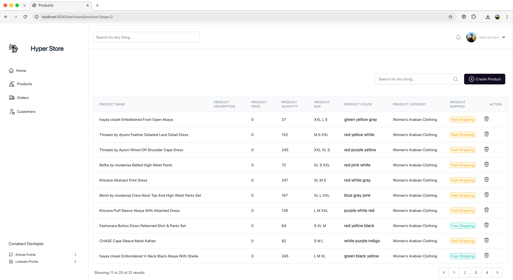

### Hyper Store - E-commerce Website


## Introduction
In this project, I have created a full-stack e-commerce website with Laravel, Livewire, Tailwind CSS, Stripe, and Algolia. I have also created an advanced admin panel with roles and permissions.

## Features
- Full-featured shopping cart
- Product reviews and ratings
- Product search with Algolia
- Product categories
- Admin panel with roles and permissions
- Order management
- Coupon codes
- Stripe payment gateway
- User profile with orders
- User roles and permissions
- Email notifications
- And much more

## Installation
1. Clone the repository
```bash
git clone
```
2. Install composer dependencies
```bash
composer install
```
3. Install NPM dependencies
```bash
npm install
```
4. Create a copy of your .env file
```bash
cp .env.example .env
```
5. Generate an app encryption key
```bash
php artisan key:generate
```
6. Create an empty database for our application
7. In the .env file, add database information to allow Laravel to connect to the database
8. Migrate the database
```bash
php artisan migrate
```
9. Seed the database
```bash
php artisan db:seed
```
10. Add Stripe and Algolia credentials to the .env file
11. Start the server
```bash
php artisan serve
```


